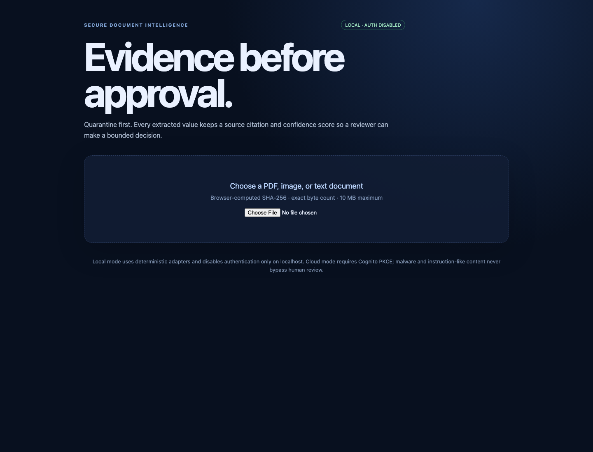

# Secure Document Intelligence

Secure Document Intelligence is a local-first document intake and review service for teams that need traceable automation. It accepts bounded uploads, quarantines untrusted content, screens for malware, extracts fields with confidence and source citations, routes uncertain or instruction-like text to a human, and records tenant-scoped audit events.


> **Status:** AWS resources are planned in Terraform and have not been deployed or applied; local and CI evidence is not deployment evidence.

## Purpose and usefulness

Document automation is only useful when a reviewer can verify the result and explain what happened. This service keeps untrusted bytes and extracted text behind explicit boundaries, requires a browser-declared SHA-256 contract, preserves citations and confidence, and makes review, correction, audit, and deletion observable.

It is useful as a reference implementation for document intake, human-in-the-loop review, tenant isolation, and a gated AWS delivery path. The local flow is deterministic and credential-free; the AWS design is an unexecuted target.

## Capabilities

- Browser-computed SHA-256, exact byte count, MIME, and filename validation.
- Quarantine-first processing with malware and instruction-like-content handling.
- Deterministic fixture extraction with field confidence and source citations.
- Human correction, approve/reject decisions, audit history, and tenant-scoped deletion.
- Durable local adapters for DynamoDB Local, MinIO, scanners, OCR, and optional Ollama.
- AWS Terraform design for CloudFront, Cognito PKCE, API Gateway JWT authorization, Lambda, S3, SQS/DLQ, DynamoDB, KMS, GuardDuty Malware Protection, Textract, Bedrock, and CloudWatch.

## Architecture

The local UI calls FastAPI. The API records document state and jobs, while a separate worker claims jobs, reads quarantine content, runs scanner/OCR/model adapters, and records extraction, review, audit, and clean promotion. The cloud diagram separates the browser/CloudFront/Cognito/API path from the data plane: S3 `ObjectCreated` enqueues SQS, GuardDuty tags quarantine content asynchronously, and the worker gates promotion on that tag.

The diagrams are design and system-boundary evidence. They do not assert that AWS resources exist.

## Run locally

With Docker:

```sh
docker compose up --build
# API docs: http://localhost:8000/docs
# Review UI: http://localhost:5173
```

The local UI displays `LOCAL · AUTH DISABLED` only on localhost and uses deterministic fixture adapters by default. For local scanner/OCR adapters, use `ADAPTER_MODE=real docker compose --profile scanners up --build`; for Ollama, use `MODEL_ADAPTER=ollama docker compose --profile ai up --build`.

Without Docker:

```sh
cd api && python -m venv .venv && . .venv/bin/activate
pip install -r requirements.txt
uvicorn app.main:app --reload
```

Open the UI, upload a text invoice, inspect cited fields and the audit trail, try the EICAR fixture or an instruction-like sentence, correct/approve uncertain output, and confirm deletion.



*Browser-captured local mode (`LOCAL · AUTH DISABLED`) using the deterministic fixture adapters.*

## API surface

| Method | Route | Purpose |
| --- | --- | --- |
| POST | `/v1/uploads` | Create a 15-minute bounded upload descriptor |
| PUT | `/v1/documents/{id}/content` | Verify and store local content |
| POST | `/v1/documents/{id}/process` | Enqueue processing |
| GET | `/v1/documents/{id}` | Read tenant-scoped status and metadata |
| GET | `/v1/documents/{id}/extractions` | Read cited fields and confidence |
| POST | `/v1/documents/{id}/reviews` | Correct, approve, or reject |
| GET | `/v1/documents/{id}/audit-events` | Read tenant-scoped audit history |
| DELETE | `/v1/documents/{id}` | Delete object content and related records |

## Verification and evidence

Run the checks from the repository root or the indicated directory:

```sh
cd api && pytest -q
cd ../frontend && npm ci && npm test && npm run build && npm run test:e2e
cd ../.. && terraform -chdir=infra/aws fmt -check
terraform -chdir=infra/aws init -backend=false -input=false
terraform -chdir=infra/aws validate
docker compose config --quiet
```

CI exposes six gates: API tests, frontend test/build, Terraform validation, Lambda contract tests, Terraform contract tests, and security scanning with Gitleaks plus a repository-root Trivy filesystem scan. The [evidence matrix](docs/evidence-matrix.md) maps claims to local checks and separately identifies evidence still required after an approved AWS deployment.

## Exact deployment method: gated AWS delivery

AWS delivery is manual and protected. Read [`docs/runbooks/deploy.md`](docs/runbooks/deploy.md), review the Terraform plan and [cost model](docs/cost-model.md), and dispatch exactly one typed action: `PLAN`, `APPLY`, `SMOKE`, or `DESTROY`. The workflow requires the protected GitHub environment and OIDC role; it does not accept static cloud credentials. Outputs include the CloudFront URL and deployment identifiers needed by the next gate. A release is not cloud-verified until smoke and destroy verification have completed with sanitized evidence.

## Security, limitations, and pre-deployment blockers

Files and extracted text are hostile data. The service checks filename traversal, MIME, size, tenant, declared digest, observed digest, malware status, and instruction-like content before clean promotion. Local fixture mode is not malware assurance, and Textract/Bedrock are disabled by default.

Before an AWS apply, review the [security checklist](SECURITY.md), threat model, and runbook. Account-level validation is still required for identity-provider setup, quotas, cost, CloudFront propagation, service limits, private networking, alerting, and recovery. No cloud resource, account, credential, smoke test, or apply is claimed by this repository state.

AWS Architecture Icons are used as the visual language and attributed to the [official AWS Architecture Icons resource](https://aws.amazon.com/architecture/icons/). The diagrams contain only resources represented in Terraform; neither Step Functions nor EventBridge is implied.

Read [development](docs/development.md), [threat model](docs/threat-model.md), [AI risk mapping](docs/ai-risk-mapping.md), [runbooks](docs/runbooks/), and [ADRs](docs/decisions/).
