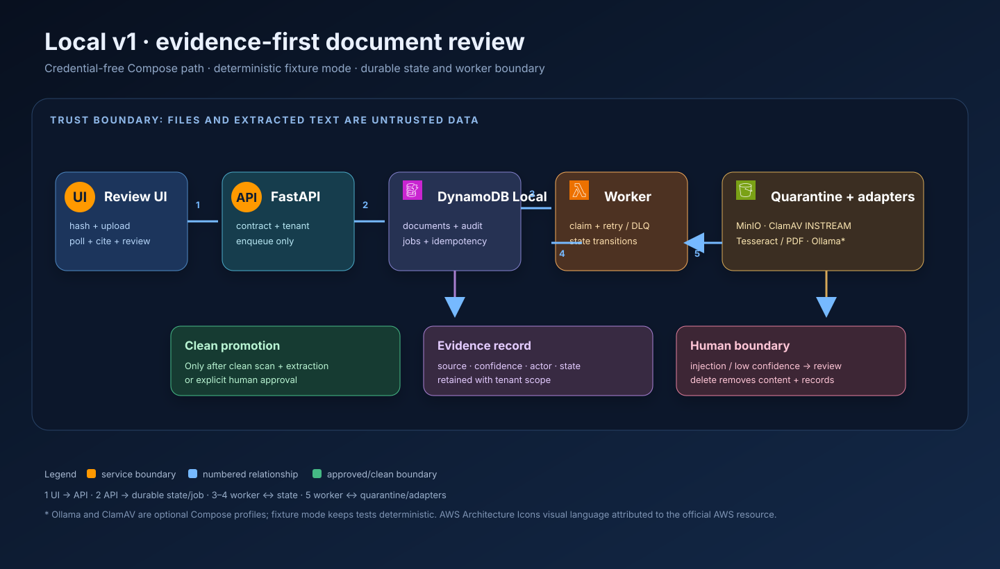
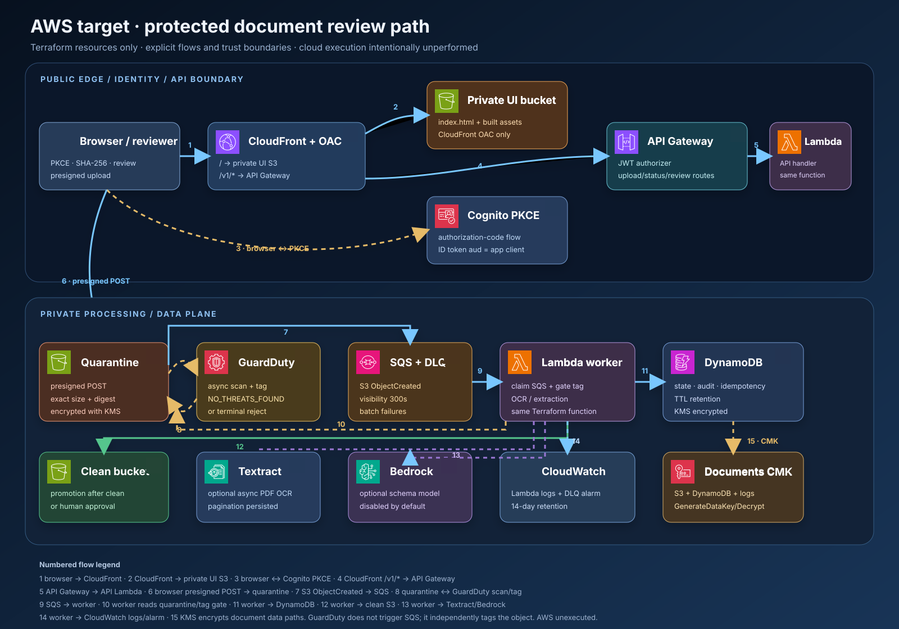
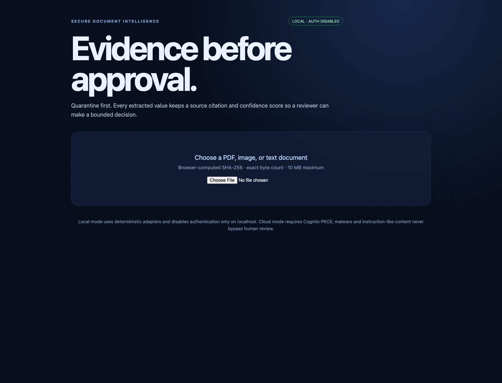

<!-- reader-first-readme:v1 -->

# Secure Document Intelligence

Secure Document Intelligence helps a review team turn uploaded documents into structured, traceable information without silently trusting either the file or an AI-generated answer. It checks each upload, keeps suspicious content isolated, shows where extracted values came from, and sends uncertain results to a person for review.

The central idea is that automation prepares the work, while people retain control over decisions that need judgment.

## The 30-second overview

Imagine an operations team receiving an invoice:

1. A team member selects the file in the review website.
2. The browser records its exact size and digital fingerprint so the service can detect an altered or incomplete upload.
3. The service places the file in quarantine and checks it before treating it as safe.
4. Document fields are extracted together with confidence scores and citations to the source text.
5. A clear result can move forward; a suspicious instruction or low-confidence result waits for a reviewer.
6. The reviewer corrects, approves, or rejects the result.
7. The service records the history, and an authorized user can later delete the document and its related records.

The repository includes a deterministic local mode, so this complete journey can be demonstrated without sending documents to a cloud service.

## What people can do

These capabilities make document review useful when a team needs both faster extraction and evidence for each decision.

- Upload text, PDF, PNG, or JPEG documents within defined size limits.
- See processing state, extracted fields, confidence, and source citations.
- Correct an extracted value before approving it.
- Reject unsafe or unsuitable content.
- Inspect a chronological audit history of important actions.
- Keep one organization's records separated from another's.
- Delete a document together with its stored content and related records.
- Exercise malware, suspicious-instruction, retry, and failed-job paths with safe fixtures.

## A representative reviewer journey

Suppose a reviewer uploads an invoice whose total is written as `125.40`. The browser calculates a SHA-256 digest—a repeatable digital fingerprint—and declares the filename, type, and byte count. The API accepts only content that matches that declaration.

A background worker then claims the processing job. It reads the quarantined content through restricted adapters, checks the scan result, and extracts the invoice fields. The review screen displays `125.40`, its confidence score, and the source passage that supports it. If confidence is below 80%, or the document contains text that looks like an instruction aimed at the automation, the result becomes `NEEDS_REVIEW` instead of being automatically accepted.

The reviewer can correct the value and approve it. Both the original extraction and the human decision remain visible in the audit history. A later deletion request removes the stored object and related tenant-scoped records.

## Security choices and trust boundaries

An uploaded file and its text are treated as hostile input, not instructions for the system.

- Content first enters quarantine, which is isolated from approved documents.
- Filename, media type, size, and digital fingerprint must agree with the upload declaration.
- A malware result must be available before cloud processing promotes content as clean.
- Text that resembles instructions to an AI triggers human review.
- The extraction model cannot approve, delete, execute commands, or call tools.
- Every read or change is scoped to the caller's organization.
- Low-confidence values require a person's decision, and corrections become audit events.

Local fixture mode demonstrates these control decisions, but it is not a substitute for a production malware scanner or identity system.

## System architecture: how a document moves



In plain language:

1. The review website declares an upload to the FastAPI application programming interface (API).
2. The API verifies the upload contract, records document state, and creates background work.
3. A separate worker claims the job and reads the quarantined content.
4. Scanner, text-recognition, and extraction adapters examine the document behind explicit boundaries.
5. The worker stores fields, confidence, citations, status, and audit events.
6. The reviewer reads the result through the API and makes the final correction, approval, rejection, or deletion decision.

The same application contract supports lightweight local components and the AWS design; adapters isolate the differences between them.

## Technology guide in plain English

| Technology | Its job in this project |
| --- | --- |
| React | Builds the review screens used in a web browser. |
| FastAPI | Runs the API that validates requests and applies document rules. |
| Worker | Processes jobs separately so an upload does not have to wait for extraction to finish. |
| Docker Compose | Starts the local website, API, worker, storage, queue, and optional adapters together. |
| DynamoDB Local | Mimics the project's cloud record store on the operator's computer. |
| MinIO | Provides local object storage for quarantined and clean document files. |
| ClamAV | Provides the optional local malware-scanning adapter. |
| Tesseract | Provides the optional local optical character recognition (OCR) adapter that turns an image into text. |
| Ollama | Can run the optional local language-model adapter. Deterministic fixtures are the default. |
| Terraform | Describes the proposed AWS environment as reviewable code. |
| GitHub Actions | Repeats tests, builds, security scans, and the protected AWS delivery gates. |

## AWS cloud resources architecture

The cloud design replaces the local identity, storage, queue, and extraction adapters with managed AWS services while keeping the same quarantine-and-review flow.



The diagram uses the [official AWS Architecture Icons](https://aws.amazon.com/architecture/icons/); the preserved source icons and release provenance are recorded in [the diagram asset notes](docs/diagrams/assets/README.md).

In this design, Amazon CloudFront serves the private website and routes API requests. Amazon Cognito proves the user's identity, and API Gateway passes authorized requests to AWS Lambda. An upload goes directly into an Amazon S3 quarantine bucket. The new object creates an Amazon Simple Queue Service (SQS) job, while GuardDuty Malware Protection scans and tags it independently. The worker waits for that result, uses Amazon Textract for document text and optional Amazon Bedrock extraction, then stores records in DynamoDB and promotes accepted content to clean storage. AWS Key Management Service (KMS) protects document data, and CloudWatch receives operational logs and signals.

### Deployment status

The planned resources shown here have not been deployed to an AWS account. To use the cloud path, an operator deploys an independent environment through the protected GitHub Actions workflow described below. Local and continuous-integration results validate the application and infrastructure definitions; they are not evidence of a live AWS deployment.

## What was tested

Recorded local evidence covers:

- API behavior, persistence, retries, and dead-letter handling.
- The complete browser upload, quarantine, worker, extraction, audit, review, and deletion journey.
- Malware-fixture and suspicious-instruction routing.
- Frontend type checking, contract tests, and a production build.
- Lambda and Terraform contract tests.
- Terraform formatting and configuration validation without contacting an AWS account.
- Docker Compose configuration and an integrated local run using durable DynamoDB Local and MinIO storage.
- Repository secret and vulnerability scanning in continuous integration.

The [evidence matrix](docs/evidence-matrix.md) maps each claim to its check and clearly separates local evidence from checks that still require an AWS deployment.

## Important limitations

- No AWS environment has been deployed or smoke-tested for this repository, so account permissions, quotas, service integration, CloudFront propagation, and cloud cleanup remain unverified.
- Deterministic local extraction proves workflow behavior, not the accuracy of a production document model.
- Local fixture scanning is not malware assurance; use the real scanner adapter or the designed cloud control for security testing.
- Amazon Textract and Bedrock are disabled by default and would introduce usage charges when enabled.
- The current design needs account-specific decisions for budgets, alerting, private networking, recovery, and retention before production use.
- Human approval reduces automation risk but does not prove that a reviewer's decision is correct.
- The included interface and controls are a bounded document workflow, not a complete enterprise records-management platform.

## Running the project locally

This section is for someone operating the project. A non-technical reader can stop here without missing the product story.

### Before you begin

The simplest path requires Docker with Docker Compose. The services default to ports `5173` for the website and `8000` for the API.

### 1. Start the application

From the repository folder:

```sh
docker compose up --build
```

Open `http://localhost:5173`. API documentation is available at `http://localhost:8000/docs`.

The visible `LOCAL · AUTH DISABLED` label is intentional: local mode uses a fixed demonstration tenant and deterministic fixture adapters rather than pretending cloud authentication is active.



### 2. Try the representative workflow

Upload a text invoice, inspect its cited fields and audit events, correct an uncertain result, and approve or reject it. Then delete it and confirm that its records are no longer available. The safe EICAR antivirus test fixture or an instruction-like sentence can be used to explore the review gates.

To use local scanner and OCR processes instead of fixtures:

```sh
ADAPTER_MODE=real docker compose --profile scanners up --build
```

To include the optional Ollama model adapter:

```sh
MODEL_ADAPTER=ollama docker compose --profile ai up --build
```

### 3. Stop the local environment

Press `Ctrl+C`, then run:

```sh
docker compose down
```

Named volumes preserve local demonstration data. Removing those volumes with `docker compose down --volumes` permanently deletes that data.

## Checking the project

Python 3.12 or 3.13, Node.js 20, Terraform, and Docker are used by the full check set:

```sh
cd api
python -m venv .venv
. .venv/bin/activate
pip install -r requirements.txt
pytest -q

cd ../frontend
npm ci
npm test
npm run build
npm run test:e2e

cd ..
terraform -chdir=infra/aws fmt -check
terraform -chdir=infra/aws init -backend=false -input=false
terraform -chdir=infra/aws validate
python -m pytest -q infra/aws/lambda/test_handler_contract.py infra/aws/test_terraform_contract.py
docker compose config --quiet
```

## How to deploy using the protected AWS workflow

AWS delivery is intentionally manual and protected. It uses GitHub's identity connection to AWS rather than stored AWS access keys.

Before deploying, an operator must provide an approved AWS account and region, a budget and incident owner, encrypted remote Terraform state, a protected GitHub environment, and a narrowly trusted AWS role. Review the [deployment runbook](docs/runbooks/deploy.md), [security checklist](SECURITY.md), [threat model](docs/threat-model.md), and [cost model](docs/cost-model.md).

From the repository's **Actions → AWS on demand** page, dispatch these typed gates in order:

1. `PLAN` previews the exact infrastructure and cost-sensitive changes.
2. `APPLY` creates the resources, configures the sign-in callback, builds the website, and publishes it behind CloudFront.
3. `SMOKE` uses a short-lived fictional-user token to verify upload, processing, citations, review, audit, and deletion.
4. `DESTROY` removes the temporary environment; the operator then checks for intentionally retained or leftover resources.

If an apply fails, preserve its logs and run a corrected `PLAN`; do not manually edit Terraform state. The S3 `force_destroy` option can permanently delete documents and should be enabled only for an explicitly approved temporary environment. Exact variables, outputs, verification, rollback, and cleanup procedures are in the [gated deployment runbook](docs/runbooks/deploy.md).

## Repository map

| Location | Contents |
| --- | --- |
| `frontend` | Browser review interface, upload contract, tests, and build configuration. |
| `api/app` | API rules, local and cloud adapters, background worker, and storage boundaries. |
| `api/tests` | Automated API and workflow behavior checks. |
| `infra/aws` | Terraform resources plus AWS Lambda API and worker handlers. |
| `docs/diagrams` | System and AWS diagrams with official-icon source assets. |
| `docs/evidence-matrix.md` | Claim-by-claim verification record and remaining cloud evidence. |
| `docs/threat-model.md` | Trust boundaries, risks, and mitigations. |
| `docs/runbooks` | Deployment and incident procedures. |
| `.github/workflows` | Continuous-integration checks and protected AWS actions. |

More detail is available in [development guidance](docs/development.md), the [AI risk mapping](docs/ai-risk-mapping.md), [architecture decisions](docs/decisions/), and [contribution guide](CONTRIBUTING.md).

Licensed under the MIT License.
